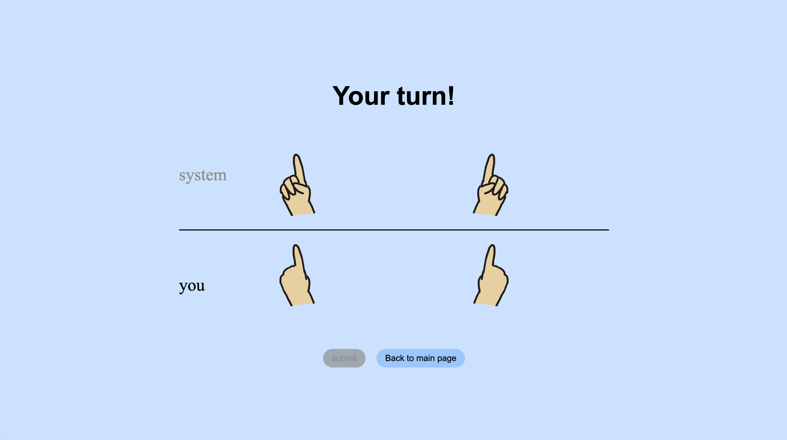
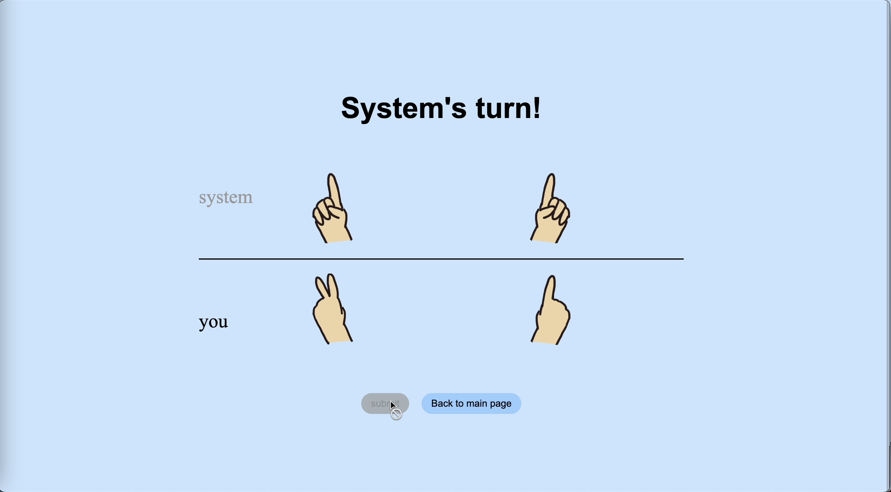

This game is tested with Python 3.12.1. It requires the library bottle. Download using:
```
pip install bottle
```
From the terminal, execute the script server/server.py Use the link output to open the app.
The terminal-based game can be played through prototype/prototype.py. The game is set to difficult by default, which can be adjusted through changing the level parameter in play function. 0 to 2 represents easy, moderate, and difficult mode respectively. 

———————— Game rules below (the rules can also be found in the rules page of the game!) ————————

Number bumping is a common game among Chinese children, which requires two people to add together numbers of their two hands.
At the start of the game, the two players both hold out their hands and gesture at one.



They can bump any of their hands with the opponent's in turns, and the player's currently bumped hand will be changed to the sum of the two hands. In the game, this is done by pressing a hand from both side of the system and the player. The hands are literally "bumped", which is shown by the animation after the "submit" button is pressed. (Notice player's left hand)



  
When the sum exceeds 10, then the player's hand should only show the ones digit without the tens.


When a hand reaches 10, it will be withdrawn from the game and becomes unavailable to be bumped. This is indicated by the grey color.


When one player withdraws both of their hands, then they win the game, while the opponent loses. The game reaches a tie if both players each have only one hand left, and their bumped numbers are cycling and never reaches 10.


（嗯总之就是一个线上版碰数；多人联机版coming s∞n）